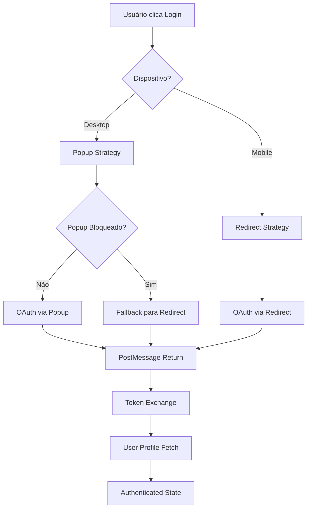

# ADR-001: Sistema de Autenticação LinkedIn

**Status**: Aceito  
**Data**: 2024-12-29  
**Autor**: Tiago Pinto Silva  

## Contexto

O projeto de portfolio pessoal necessita de um sistema de autenticação para:
- Personalizar experiência do usuário
- Coletar dados analytics avançados
- Demonstrar capacidades técnicas de integração OAuth
- Facilitar networking e conexões profissionais

A escolha da plataforma de autenticação é crítica considerando:
- Público-alvo: profissionais de tecnologia
- Simplicidade de implementação
- Experiência do usuário
- Compatibilidade mobile/desktop

## Decisão

**Implementar autenticação exclusiva via LinkedIn OAuth 2.0** com as seguintes características:

### Arquitetura Escolhida
- **OAuth 2.0 Authorization Code Flow** com PKCE para segurança
- **Hybrid popup/redirect strategy** adaptável por dispositivo
- **Serverless API endpoints** no Vercel para token exchange
- **Client-side token handling** com storage seguro

### Estratégia Multi-Dispositivo

### Endpoints Implementados
- `/api/auth/linkedin/token.js` - Token exchange
- `/api/auth/linkedin/profile.js` - Profile data retrieval
- `/auth/linkedin/callback` - OAuth callback handler

## Consequências

### Positivas ✅
- **Alinhamento com público-alvo**: LinkedIn é a rede social profissional padrão
- **Dados ricos**: Acesso a headline, localização, indústria, etc.
- **Experiência streamlined**: Login único, sem múltiplas opções
- **Demonstração técnica**: Mostra competência em OAuth e integração APIs
- **Mobile-friendly**: Estratégia adaptável para diferentes dispositivos

### Negativas ❌
- **Dependência única**: Sem fallback se LinkedIn estiver indisponível
- **Limitações de API**: Rate limiting do LinkedIn pode afetar usuários
- **Exclusão de usuários**: Pessoas sem LinkedIn não podem autenticar
- **Complexidade mobile**: Popups problemáticos em dispositivos móveis

### Riscos Mitigados
- **Popup blocking**: Fallback automático para redirect
- **Cross-browser compatibility**: Testes abrangentes implementados
- **Token security**: Armazenamento seguro com validação
- **Error handling**: Sistema robusto de tratamento de erros

## Implementação

### Componentes Principais
- `AuthContext.tsx` - Estado global de autenticação
- `AuthButton.tsx` - UI component para login/logout
- `LinkedInCallback.tsx` - Handler de callback OAuth
- `useAuth.ts` - Hook para acesso ao contexto

### Configuração de Segurança
- **State parameter validation** para prevenir CSRF
- **Origin validation** em postMessages
- **Token expiration handling** automático
- **XSS protection** via sanitização de dados

### Analytics Integration
- Tracking completo do fluxo de autenticação
- Métricas de sucesso/falha por dispositivo
- Dados demográficos para personalização

## Alternativas Consideradas

### 1. Auth0 / Firebase Auth
- **Prós**: Múltiplos providers, gestão profissional
- **Contras**: Overhead para projeto simples, custos adicionais
- **Decisão**: Rejeitado por complexidade desnecessária

### 2. GitHub OAuth
- **Prós**: Alinhado com desenvolvedores
- **Contras**: Dados limitados para networking profissional
- **Decisão**: Rejeitado por menor relevância

### 3. Google OAuth
- **Prós**: Adoção universal
- **Contras**: Menos contextualizado para portfolio profissional
- **Decisão**: Rejeitado por menor valor agregado

## Monitoramento

### Métricas Chave
- Taxa de conversão de auth por dispositivo
- Tempo médio de fluxo de autenticação
- Rate de falhas por tipo de erro
- Abandono no popup vs redirect

### Alertas Configurados
- Falhas de API acima de 5%
- Latência de token exchange > 3s
- Rate limiting do LinkedIn

## Revisão

Esta decisão deve ser revisada se:
- Taxa de falha de autenticação > 10%
- Feedback negativo significativo sobre LinkedIn obrigatório
- Mudanças nas políticas de API do LinkedIn
- Necessidade de suporte a usuários sem LinkedIn

---

**Próximo ADR**: [ADR-002: Tratamento de Erros de Autenticação](ADR-002-tratamento-erros-auth.md)