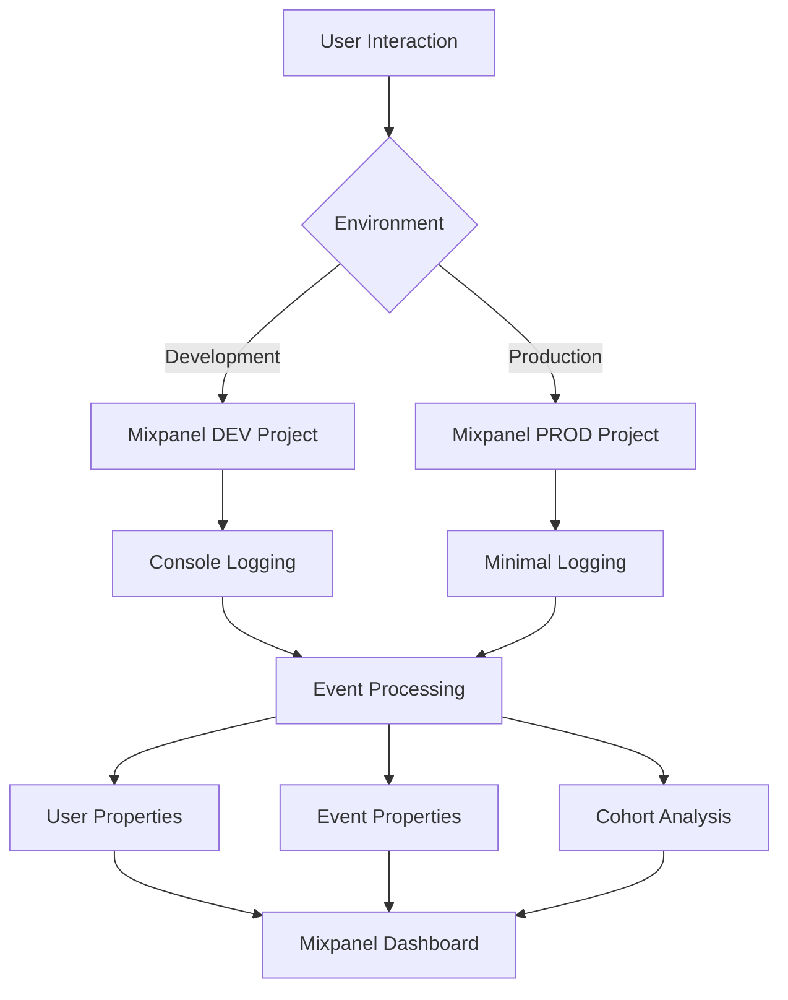

# ADR-003: Integração Analytics com Mixpanel

**Status**: Aceito  
**Data**: 2024-12-29  
**Autor**: Tiago Pinto Silva  

## Contexto

O projeto de portfolio pessoal necessita de analytics avançados para:
- **Entender comportamento** dos visitantes e recrutadores
- **Otimizar conteúdo** baseado em dados reais de engajamento
- **Demonstrar competência** em implementação de tracking
- **Medir efetividade** de diferentes seções do portfolio

### Requisitos Identificados
- Tracking de **leitura de artigos** (scroll depth, tempo, completion)
- **Funil de conversão** para contato/networking
- **Segmentação de usuários** (authenticated vs anonymous)
- **A/B testing** para otimização de conteúdo
- **Event tracking** para todas as interações importantes

### Constraints
- **Budget limitado** - necessidade de plano free/starter
- **Performance** - não impactar loading da página
- **Privacy compliance** - LGPD considerations
- **Environment separation** - dev vs production data

## Decisão

**Implementar Mixpanel como plataforma única de analytics** com arquitetura event-driven e separação por ambiente.

### Arquitetura Escolhida



### Environment Configuration Strategy
```typescript
// Estratégia de tokens separados (recomendada)
const mixpanelConfig = {
  development: {
    token: process.env.VITE_MIXPANEL_TOKEN_DEV,
    debug: true,
    track_pageview: true,
    persistence: 'localStorage'
  },
  production: {
    token: process.env.VITE_MIXPANEL_TOKEN_PROD,
    debug: false,
    track_pageview: false, // Manual control
    persistence: 'cookie'
  }
}
```

### Event Taxonomy
```typescript
// Estrutura hierárquica de eventos
interface EventTaxonomy {
  // Navigation Events
  'Page View': PageViewProperties
  'Section View': SectionViewProperties
  'External Link Click': ExternalLinkProperties
  
  // Content Engagement  
  'Article Started': ArticleEngagementProperties
  'Article Milestone': ArticleProgressProperties
  'Article Completed': ArticleCompletionProperties
  
  // User Actions
  'Contact Attempted': ContactProperties
  'LinkedIn Profile View': SocialProperties
  'Project View': ProjectProperties
  
  // Authentication Flow
  'Auth Modal Shown': AuthModalProperties
  'LinkedIn OAuth Initiated': AuthInitProperties
  'User Authenticated': AuthSuccessProperties
  'Authentication Error': AuthErrorProperties
}
```

## Implementação

### 1. Context-Based Architecture
```typescript
// MixpanelContext para estado global
export const MixpanelProvider: React.FC<{children: ReactNode}> = ({children}) => {
  const [mixpanel, setMixpanel] = useState<Mixpanel | null>(null)
  const [isEnabled, setIsEnabled] = useState(false)
  
  // Inicialização com lazy loading
  useEffect(() => {
    initializeMixpanel()
  }, [])
}

// Hook customizado para uso fácil
export const useMixpanel = () => {
  const context = useContext(MixpanelContext)
  if (!context) throw new Error('useMixpanel must be used within MixpanelProvider')
  return context
}
```

### 2. Article Analytics System
```typescript
// Hook especializado para tracking de artigos
export const useArticleAnalytics = (article: Article) => {
  const { track } = useMixpanel()
  
  // Scroll depth tracking
  useEffect(() => {
    const handleScroll = throttle(() => {
      const scrollPercent = calculateScrollPercent()
      const milestones = [25, 50, 75, 90]
      
      milestones.forEach(milestone => {
        if (scrollPercent >= milestone && !reachedMilestones.has(milestone)) {
          track('Article Milestone', {
            article_id: article.id,
            article_title: article.title,
            milestone_percent: milestone,
            reading_time_seconds: getReadingTime(),
            word_count: estimateWordCount(article.content)
          })
          reachedMilestones.add(milestone)
        }
      })
    }, 1000)
    
    window.addEventListener('scroll', handleScroll)
    return () => window.removeEventListener('scroll', handleScroll)
  }, [])
}
```

### 3. User Identification Strategy
```typescript
// Enhanced user identification com LinkedIn data
const identifyLinkedInUser = (userData: LinkedInUser) => {
  identify(userData.id)
  
  setUserProperties({
    $name: userData.name,
    $email: userData.email,
    linkedin_id: userData.id,
    linkedin_headline: userData.headline,
    linkedin_location: userData.location,
    linkedin_industry: userData.industry,
    authenticated_user: true,
    auth_provider: 'linkedin',
    first_auth_date: new Date().toISOString(),
    user_type: 'authenticated'
  })
}

// Anonymous user tracking
const identifyAnonymousUser = () => {
  const anonymousId = generateAnonymousId()
  identify(anonymousId)
  
  setUserProperties({
    user_type: 'anonymous',
    first_visit: new Date().toISOString(),
    device_type: isMobile ? 'mobile' : 'desktop',
    browser: detectBrowser(),
    source: getUTMSource() || 'direct'
  })
}
```

### 4. Defensive Implementation
```typescript
// Graceful degradation quando Mixpanel falha
export const track = (eventName: string, properties?: Record<string, any>) => {
  try {
    if (!mixpanel || !(mixpanel as any)._flags) {
      console.warn('⚠️ Mixpanel not properly initialized')
      return
    }
    
    const enhancedProperties = {
      ...properties,
      timestamp: new Date().toISOString(),
      page_url: window.location.href,
      user_agent: navigator.userAgent,
      environment: import.meta.env.MODE
    }
    
    mixpanel.track(eventName, enhancedProperties)
    
    if (import.meta.env.MODE === 'development') {
      console.log('📊 Mixpanel Event:', eventName, enhancedProperties)
    }
  } catch (error) {
    console.warn('Failed to track event:', error)
  }
}
```

## Dashboards Implementados

### 1. Blog Performance Dashboard
- **Most Read Articles** por views únicos
- **Reading Completion Rates** por artigo
- **Time Spent Reading** distribuição
- **Traffic Sources** para blog posts
- **Engagement Funnel** (start → milestone → complete)

### 2. User Acquisition Dashboard  
- **New vs Returning Users** trends
- **Traffic Sources** breakdown (organic, social, direct)
- **Geographic Distribution** de visitantes
- **Device/Browser** analytics
- **Authentication Conversion** rates

### 3. Portfolio Effectiveness Dashboard
- **Section Popularity** (Hero, Cases, Expertise, Contact)
- **External Link Clicks** (GitHub, LinkedIn, projects)
- **Contact Conversion Funnel** 
- **Mobile vs Desktop** behavior
- **Page Flow** analysis

## Consequências

### Positivas ✅
- **Insights acionáveis** sobre comportamento de usuários
- **Optimization data-driven** para conteúdo
- **Demonstração de competência** em analytics
- **Funnel analysis** para melhorar conversões
- **A/B testing capability** para futuras otimizações
- **Environment separation** limpa para dev/prod

### Negativas ❌
- **Vendor lock-in** com Mixpanel
- **Privacy concerns** com tracking detalhado  
- **Bundle size increase** (~45KB para SDK)
- **Potential GDPR compliance** complexity
- **Rate limiting** em plano free (100K events/month)

### Métricas de Sucesso
- **Event volume**: ~2-5K events/month em produção
- **Dashboard utilization**: Dashboards acessados semanalmente
- **Data-driven decisions**: Pelo menos 1 otimização/mês baseada em dados
- **Performance impact**: < 200ms overhead na inicialização

## Configuração de Segurança

### Environment Variables
```bash
# .env.local
VITE_MIXPANEL_TOKEN_DEV=dev_project_token
VITE_MIXPANEL_TOKEN_PROD=prod_project_token

# Service Account (para API access)
MIXPANEL_USERNAME=ServiceAccount.username
MIXPANEL_SECRET=service_account_secret
```

### Privacy Compliance
```typescript
// Opt-out mechanism
const handleOptOut = () => {
  mixpanel.opt_out_tracking()
  localStorage.setItem('analytics_opted_out', 'true')
}

// Property blacklisting para proteção de dados
const sensitiveProperties = ['email', 'full_name', 'phone']
const sanitizeProperties = (props: Record<string, any>) => {
  return Object.fromEntries(
    Object.entries(props).filter(([key]) => !sensitiveProperties.includes(key))
  )
}
```

## Monitoramento e Alertas

### Key Performance Indicators
- **Event delivery rate** > 95%
- **Dashboard load time** < 3s
- **Data freshness** < 5 minutes delay
- **Error rate** < 1% de events

### Automated Monitoring
```typescript
// Health check para Mixpanel
const healthCheck = () => {
  track('System Health Check', {
    mixpanel_status: 'operational',
    events_queued: getQueuedEventsCount(),
    last_successful_event: getLastEventTimestamp()
  })
}

setInterval(healthCheck, 5 * 60 * 1000) // A cada 5 minutos
```

## Alternativas Consideradas

### 1. Google Analytics 4
- **Prós**: Free forever, integration com Google stack
- **Contras**: Event tracking menos flexível, setup mais complexo
- **Decisão**: Rejeitado por menor granularidade

### 2. Amplitude
- **Prós**: Excellent cohort analysis, generous free tier
- **Contras**: Learning curve maior, overkill para projeto pessoal
- **Decisão**: Rejeitado por complexidade

### 3. Custom Analytics
- **Prós**: Total control, zero vendor lock-in
- **Contras**: Desenvolvimento extenso, maintenance overhead
- **Decisão**: Rejeitado por time-to-value

## Evolução Futura

### Phase 2 Features
- **Heatmap integration** com Hotjar/LogRocket
- **A/B testing framework** para otimização
- **Email tracking** para newsletter engagement
- **Conversion attribution** multi-touch

### Scale Considerations
- **Migration path** para plan pago se necessário
- **Data retention** policies para compliance
- **Real-time dashboards** para monitoramento

## Revisão

Esta decisão deve ser revisada se:
- **Rate limiting** se tornar restritivo (>80% do limite)
- **Performance impact** exceder 300ms
- **Privacy regulations** mudarem significativamente
- **ROI das insights** não justificar complexidade

---

**ADR Anterior**: [ADR-002: Tratamento de Erros de Autenticação](ADR-002-tratamento-erros-auth.md)  
**Próximo ADR**: [ADR-004: Framework de Testes com Cypress](ADR-004-testing-cypress.md)