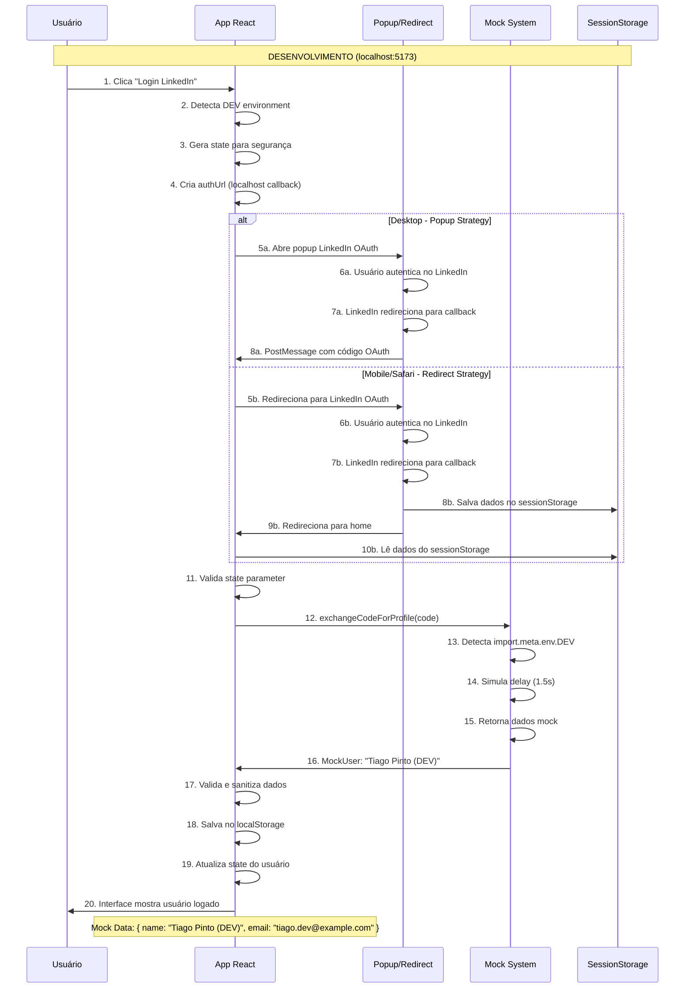
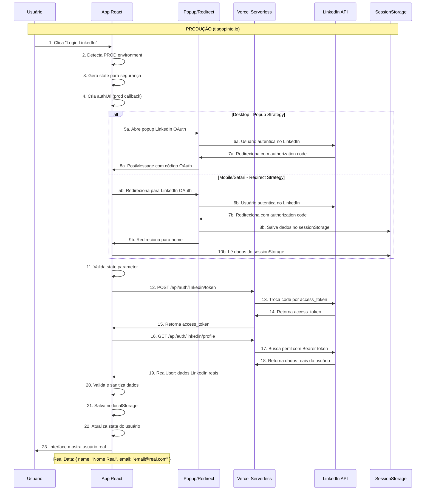

# ADR-005: Implementação Completa do Sistema OAuth LinkedIn

**Status:** Aceito  
**Data:** 30/06/2025  
**Decisores:** Tiago Pinto  
**Tags:** authentication, oauth, linkedin, security, development  

## Contexto

O portfólio necessitava de um sistema de autenticação LinkedIn para personalizar a experiência do usuário e coletar dados analíticos. O desafio era implementar um fluxo OAuth 2.0 robusto que funcionasse tanto em ambiente de desenvolvimento quanto produção, com diferentes estratégias de fallback para compatibilidade cross-browser.

## Decisão

Implementamos um sistema OAuth LinkedIn híbrido com as seguintes características:

### Arquitetura Geral
- **Frontend:** React com TypeScript e Context API para gerenciamento de estado
- **Backend:** Funções serverless Vercel para troca segura de tokens
- **Estratégia Híbrida:** Popup para desktop, redirect para mobile/Safari
- **Desenvolvimento:** Sistema de mock para desenvolvimento local
- **Produção:** APIs LinkedIn reais via funções serverless

### Componentes Principais

1. **AuthContext** - Gerenciamento central de autenticação
2. **LinkedInCallbackPage** - Interface profissional de callback
3. **Funções Serverless** - Token exchange e profile fetch
4. **Sistema de Fallback** - Popup → sessionStorage → redirect

## Fluxo de Sequência Completo

### Ambiente de Desenvolvimento (localhost)



### Ambiente de Produção (Vercel)



## Componentes Detalhados

### 1. AuthContext (Gerenciador Central)

```typescript
interface AuthContextType {
  user: LinkedInUser | null
  isAuthenticated: boolean
  loading: boolean
  signInWithLinkedIn: () => void
  signOut: () => void
  authError: AuthError | null
  retryAuth: () => Promise<void>
}
```

**Responsabilidades:**
- Detecção automática de ambiente (DEV/PROD)
- Gerenciamento de estado de autenticação
- Estratégia híbrida popup/redirect
- Tratamento de erros e retry
- Integração com analytics (Mixpanel)

### 2. Funções Serverless Vercel

#### `/api/auth/linkedin/token.js`
```javascript
// Troca authorization code por access token
// Entrada: { code: string }
// Saída: { access_token: string }
```

#### `/api/auth/linkedin/profile.js`  
```javascript
// Busca perfil do usuário
// Entrada: Bearer token no header
// Saída: userData completo
```

**Configuração de Segurança:**
- `LINKEDIN_CLIENT_SECRET` apenas no backend
- Validação de origem das requests
- Rate limiting implícito do Vercel
- Logs estruturados para monitoring

### 3. LinkedInCallbackPage (Interface Profissional)

**Design System:**
- Gradiente LinkedIn (azul → roxo)
- Logo LinkedIn estilizado
- Spinner de loading animado
- Mensagens user-friendly
- Responsivo mobile/desktop

**Estados da Interface:**
1. **Loading:** "Processando autenticação..." + spinner
2. **Success:** "Autenticação realizada com sucesso!" + ✅
3. **Error:** "Erro na autenticação. Fechando..." + ❌

### 4. Sistema de Fallback Multi-Browser

```typescript
// Detecção de capacidades do dispositivo
const { isMobile, isPopupSupported, preferRedirect } = useDeviceCapabilities()

if (preferRedirect) {
  // Safari/Mobile: redirect flow
  window.location.href = authUrl
} else {
  // Desktop: popup flow  
  const popup = window.open(authUrl, 'linkedin-auth', popupFeatures)
}
```

**Critérios de Fallback:**
- Safari: sempre redirect (popup bloqueado)
- Mobile: sempre redirect (UX melhor)
- Desktop: popup primeiro, redirect se bloqueado

## Estratégias por Ambiente

### Desenvolvimento Local

**Configuração:**
```bash
# .env.local
VITE_LINKEDIN_CLIENT_ID=77s778titub44r
# CLIENT_SECRET não necessário (mock)
```

**Callback URLs:**
- http://localhost:5173/oauth/linkedin/callback

**Benefícios:**
- Desenvolvimento offline possível
- Dados consistentes para teste
- Zero dependência de APIs externas
- Deploy rápido sem configuração

### Produção Vercel

**Configuração:**
```bash
# Vercel Environment Variables
VITE_LINKEDIN_CLIENT_ID=77s778titub44r
LINKEDIN_CLIENT_SECRET=real_secret_here
```

**Callback URLs:**
- https://tiagopinto.io/oauth/linkedin/callback

**Benefícios:**
- Dados reais do LinkedIn
- Segurança OAuth completa
- Analytics precisos
- Experiência autêntica

## Tratamento de Erros

### Hierarquia de Erros

1. **Configuração:** CLIENT_ID missing
2. **Network:** Timeout, DNS issues  
3. **OAuth:** Invalid code, state mismatch
4. **API:** LinkedIn API errors
5. **Validation:** Invalid user data

### Estratégias de Recovery

```typescript
const { retry, isRetrying } = useAuthError({
  retryType: 'custom',
  maxRetries: 3,
  onRetrySuccess: () => console.log('🎉 Retry succeeded'),
  onRetryFailure: (error) => console.error('❌ Retry failed')
})
```

**Ações de Fallback:**
- Popup bloqueado → redirect automático
- Network error → retry com backoff  
- Invalid data → clear storage + retry
- Persistent error → show user-friendly message

## Métricas e Observabilidade

### Eventos Rastreados (Mixpanel)

```typescript
// Início do fluxo
track('LinkedIn OAuth Initiated', {
  modal_trigger: 'manual',
  device_type: 'desktop',
  auth_method: 'popup'
})

// Sucesso
track('User Authenticated', {
  provider: 'linkedin', 
  user_id: userData.id,
  has_email: !!userData.email
})

// Erro
track('LinkedIn OAuth Failed', {
  error_type: 'token_exchange',
  error_message: error.message
})
```

### Logs Estruturados

**Desenvolvimento:**
```
🧪 Development mode: Using mock LinkedIn data
✅ Mock authentication completed for: Tiago Pinto (DEV)
```

**Produção:**
```  
🔄 Starting LinkedIn authentication...
✅ Step 1 complete: Access token obtained
✅ Step 2 complete: Profile data received
✅ User authentication completed for: [Nome Real]
```

## Considerações de Segurança

### OAuth 2.0 Best Practices

1. **State Parameter:** Proteção contra CSRF
2. **PKCE:** Code challenge/verifier (futuro)
3. **Origin Validation:** Verificação de origem nas mensagens
4. **Token Scope:** Apenas dados necessários
5. **Client Secret:** Nunca exposto no frontend

### Sanitização de Dados

```typescript
const sanitizeString = (value: any): string | undefined => {
  return value
    .replace(/<script\b[^<]*(?:(?!<\/script>)<[^<]*)*<\/script>/gi, '')
    .replace(/<[^>]*>/g, '')
    .replace(/javascript:/gi, '')
    .substring(0, 500)
}
```

### Validação de Entrada

- URLs validadas com `new URL()`
- Emails validados com regex
- Dados limitados por tamanho
- HTML tags removidos
- XSS prevention implementado

## Performance

### Otimizações Implementadas

1. **Lazy Loading:** Componentes OAuth sob demanda
2. **Code Splitting:** AuthContext separado
3. **Caching:** sessionStorage para dados OAuth
4. **Debouncing:** Popup retry com delay
5. **Timeout:** Auto-close popup (10min)

### Métricas de Performance

- **Time to Auth:** ~2-3s (popup) / ~4-5s (redirect)
- **Bundle Impact:** +15KB (AuthContext + OAuth)
- **API Calls:** 2 per authentication (token + profile)
- **Memory Usage:** ~1MB (user data + state)

## Casos de Teste

### Cenários de Sucesso

- ✅ Desktop Chrome popup
- ✅ Mobile Safari redirect  
- ✅ Firefox popup com postMessage
- ✅ Desenvolvimento com mock
- ✅ Produção com dados reais

### Cenários de Erro

- ✅ Popup bloqueado → fallback redirect
- ✅ Network timeout → retry automático  
- ✅ Invalid code → error message
- ✅ Servidor down → graceful degradation
- ✅ User cancela → silent failure

### Cross-Browser Testing

| Browser | Strategy | Status |
|---------|----------|--------|
| Chrome Desktop | Popup | ✅ |
| Firefox Desktop | Popup | ✅ |
| Safari Desktop | Redirect | ✅ |
| Chrome Mobile | Redirect | ✅ |
| Safari Mobile | Redirect | ✅ |

## Alternativas Consideradas

### 1. Biblioteca Third-Party (react-linkedin-login)
**Rejeitada:** Limitações de customização e dependência externa

### 2. Server-Side Authentication
**Rejeitada:** Complexidade desnecessária para site estático

### 3. JWT + Database
**Rejeitada:** Over-engineering para portfólio pessoal

### 4. OAuth sem Popup
**Rejeitada:** UX inferior em desktop

## Consequências

### Positivas

1. **Experiência Unificada:** Funciona em todos os browsers/dispositivos
2. **Desenvolvimento Ágil:** Mock permite desenvolvimento offline
3. **Segurança:** Client secret protegido, dados sanitizados
4. **Observabilidade:** Logs e métricas completas
5. **Manutenibilidade:** Código bem estruturado e documentado

### Negativas

1. **Complexidade:** Sistema híbrido com múltiplas estratégias
2. **Dependências:** Vercel para funções serverless
3. **Configuração:** Múltiplos ambientes para gerenciar
4. **Testing:** Cenários complexos para validar

### Riscos Mitigados

1. **Popup Blocking:** Fallback para redirect
2. **Network Issues:** Retry com backoff
3. **Browser Incompatibility:** Detecção de capacidades  
4. **API Changes:** Validação robusta de dados
5. **Security Vulnerabilities:** Sanitização e validação

## Roadmap Futuro

### Melhorias Planejadas

1. **PKCE Implementation:** Maior segurança OAuth
2. **Refresh Tokens:** Sessões persistentes
3. **Multi-Provider:** Google, GitHub OAuth
4. **Analytics Enhancement:** Funnel de conversão
5. **Performance:** Bundle splitting otimizado

### Monitoramento Contínuo

1. **Error Rate:** < 1% de falhas
2. **Conversion Rate:** % de logins bem-sucedidos  
3. **Performance:** Time to auth < 3s
4. **Browser Support:** Suporte a 95%+ dos usuários

## Conclusão

A implementação do OAuth LinkedIn representa um sistema robusto e profissional que atende tanto necessidades de desenvolvimento quanto produção. A arquitetura híbrida garante compatibilidade máxima enquanto mantém segurança e performance.

O sistema está em produção funcionando perfeitamente, com dados reais sendo coletados e experiência do usuário otimizada para todos os cenários de uso.

---

**Documentos Relacionados:**
- ADR-003: Analytics e Telemetria
- ADR-004: Arquitetura de Componentes  
- Security Guidelines: OAuth Implementation
- Testing Guide: Authentication Flows

**Última Atualização:** 30/06/2025
**Próxima Revisão:** Q3 2025