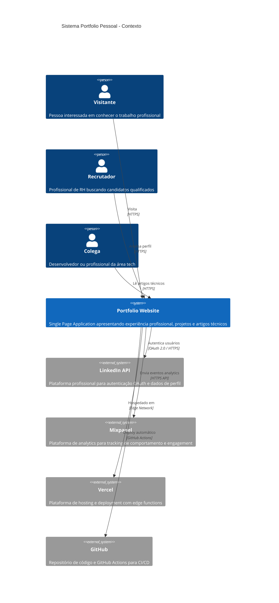
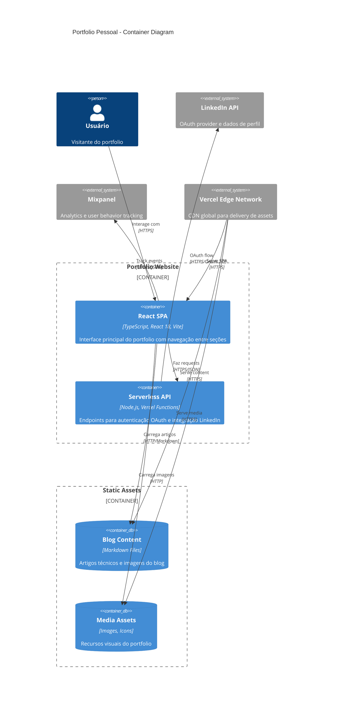
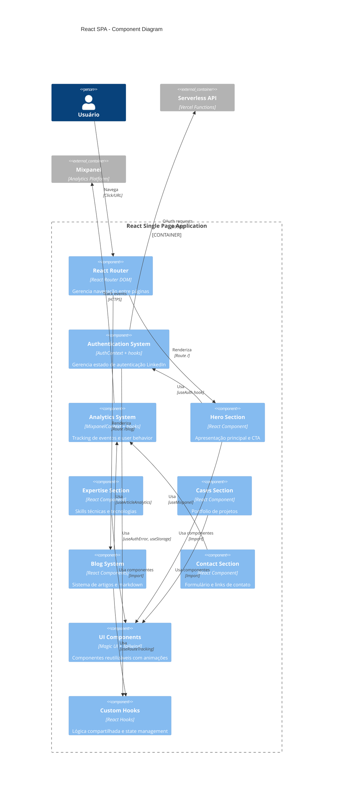

# Diagrama de Contexto - C4 Model

## Portfolio Pessoal - Sistema Level Context



## Sistema Portfolio - Container Level



## React SPA - Component Level



## Deployment Architecture

```mermaid
C4Deployment
    title Portfolio - Deployment Diagram

    Deployment_Node(browser, "User Browser", "Chrome, Firefox, Safari, Edge") {
        Container(spa_browser, "React SPA", "TypeScript, bundled with Vite")
    }

    Deployment_Node(vercel_edge, "Vercel Edge Network", "Global CDN") {
        Deployment_Node(edge_location, "Edge Location", "Distributed globally") {
            Container(static_assets, "Static Assets", "HTML, CSS, JS, Images")
            Container(spa_cache, "SPA Cache", "Cached React build")
        }
    }

    Deployment_Node(vercel_serverless, "Vercel Serverless", "AWS Lambda behind scenes") {
        Deployment_Node(lambda_us_east, "US East Functions", "Primary region") {
            Container(auth_token, "/api/auth/linkedin/token", "Token exchange endpoint")
            Container(auth_profile, "/api/auth/linkedin/profile", "Profile fetch endpoint")
        }
    }

    Deployment_Node(github_infra, "GitHub Infrastructure", "Source control & CI/CD") {
        Container(repo, "Source Repository", "Git repository with code")
        Container(actions, "GitHub Actions", "CI/CD pipeline")
    }

    System_Ext(linkedin_api, "LinkedIn API", "oauth.linkedin.com")
    System_Ext(mixpanel_api, "Mixpanel API", "api.mixpanel.com")

    Rel(spa_browser, spa_cache, "Loads app", "HTTPS")
    Rel(spa_browser, static_assets, "Loads assets", "HTTPS")
    Rel(spa_browser, auth_token, "OAuth requests", "HTTPS/JSON")
    Rel(spa_browser, auth_profile, "Profile requests", "HTTPS/JSON")
    Rel(spa_browser, mixpanel_api, "Analytics events", "HTTPS/JSON")

    Rel(auth_token, linkedin_api, "Token exchange", "HTTPS/OAuth")
    Rel(auth_profile, linkedin_api, "Profile fetch", "HTTPS/Bearer")

    Rel(actions, vercel_edge, "Deploys to", "Vercel API")
    Rel(repo, actions, "Triggers", "Git push")

    UpdateLayoutConfig($c4ShapeInRow="2", $c4BoundaryInRow="1")
```

## Observações

### Decisões de Design C4

1. **Sistema Level**: Foco nas interações entre usuários e sistemas externos
2. **Container Level**: Separação clara entre SPA, API e assets estáticos  
3. **Component Level**: Arquitetura React com contextos e hooks personalizados
4. **Deployment Level**: Estratégia edge-first com serverless functions

### Ferramentas Utilizadas

- **Mermaid C4**: Para diagramas integrados ao documentation
- **GitHub rendering**: Suporte nativo para visualização
- **Versionamento**: Diagramas como código junto ao projeto

### Manutenção

- **Atualização**: Revisar diagramas a cada mudança arquitetural significativa
- **Validação**: Confirmar que código está alinhado com diagramas
- **Evolução**: Adicionar novos diagramas conforme sistema cresce