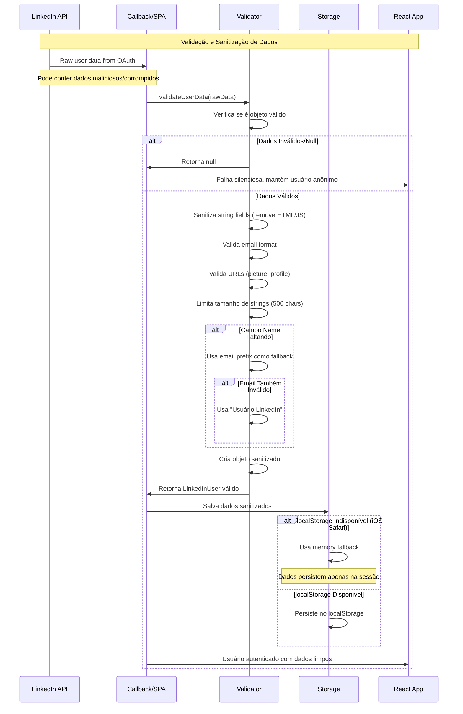

# Diagramas de Sequência - Autenticação LinkedIn

## Fluxo OAuth Completo - Desktop (Popup Strategy)

## Fluxo OAuth Mobile (Redirect Strategy)

## Error Handling Flow

## Data Validation & Sanitization

## Concurrency Control & State Management

## Analytics Event Flow

## Observações Técnicas

### Timing Considerations
- **Token expiration**: LinkedIn tokens expiram em 60 dias
- **State validation**: State parameters têm TTL de 10 minutos
- **Popup timeout**: Auto-close após 10 minutos para memory cleanup
- **Retry backoff**: 1s, 2s, 4s, 8s (exponential)

### Security Measures
- **CSRF protection**: State parameter validation obrigatória
- **Origin validation**: postMessage origins verificadas
- **Data sanitization**: Todos os dados de user sanitizados
- **XSS prevention**: HTML/JavaScript removidos de inputs

### Error Recovery
- **Automatic fallbacks**: Popup → Redirect quando necessário
- **Storage fallbacks**: localStorage → sessionStorage → memory
- **Network resilience**: Retry com backoff para network errors
- **State recovery**: Restoration de auth state após refresh

### Performance Optimization
- **Lazy loading**: Mixpanel SDK carregado sob demanda
- **Event batching**: Multiple events enviados em batch
- **Asset optimization**: Código minificado e tree-shaken
- **CDN delivery**: Assets servidos via Vercel Edge Network